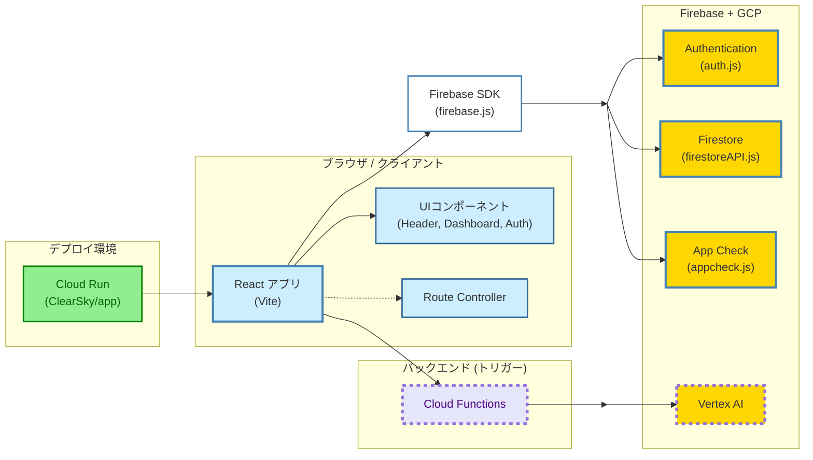
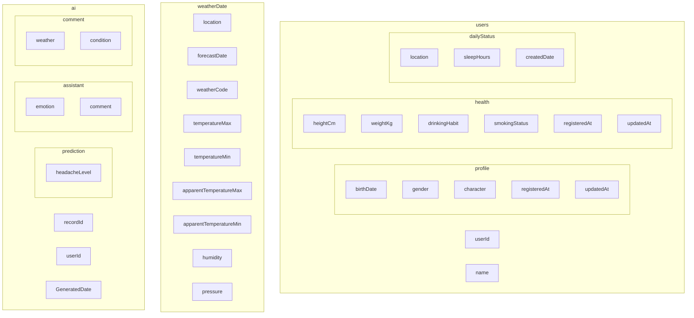
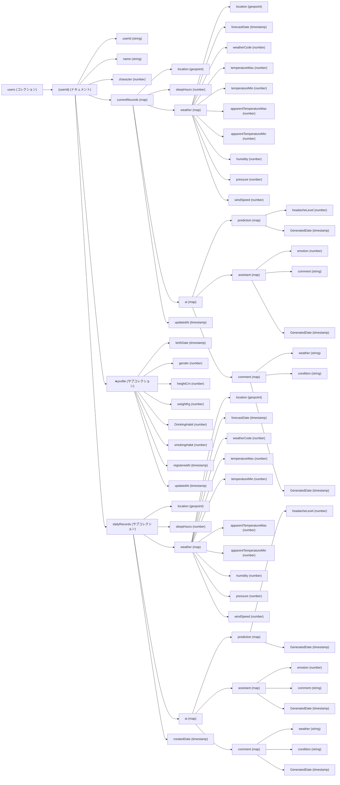

## はじめに

&nbsp;&nbsp;&nbsp;こんにちは！私たちは、チーム ツナ缶サラダです！！
普段は小学生向けプログラミングスクールにて教鞭を取っている大学生ですが、
「なんか作りてえよなあ...！」ということで、ふらっとハッカソンに応募しました笑
　結論から言うと、各々の時間的制約が相まって壮絶な開発現場となりました...。
しかしその分「Firebase」導入により、爆発的な開発期間の短縮を実感しています。
今回はそのプロジェクト解説と振り返りも兼ねて、記事を書いていこうと思います！

https://zenn.dev/hackathons/2024-google-cloud-japan-ai-hackathon  

## メンバー紹介


*チーム名： ツナ缶サラダ*

> **タケ**：インフラ、AI開発  
> AIを研究する工学専攻の大学生。麻雀が好きなヤニカスです。
> 卒研提出とハッカソン期間が丸被りで大変だったね、お疲れ様でした...！

> **マサ**：フロントエンド  
> 情報系大学生。今回のアプリの可愛らしいUIは全て彼が担っています。
> 犬が大好きで、将来は犬と2人で暮らしたいと言っていました。なんかあったのかなあ

> **カンゾー**：バックエンド、ドキュメント制作 （🫲 担当）
> 民事法専攻の文系大学生。基本的に情報工学的な知識はないド素人ですが、
> 全てを体力で補う脳筋らしいです。バグ？…気合で直します！🏋️‍♂️（なお、直らない模様）


## Zennハッカソンとは？

Zennハッカソン (正式名称： AI Agent Hackathon with Google Cloud)とは、
エンジニアのための新しい情報共有コミュニティ Zenn（Zenn 株式会社）が開催しているハッカソンのことで、GoogleのAI「Gemini」や、Google CloudのAI・コンピューティングプロダクトを活用し、アイデアを形にしてみよう！というものです。  

### スケジュール

* 登録および提出期間：2024年12月19日～2025年2月10日
* 1次審査期間：2025年2月11日～2025年2月17日
* 2次審査期間：2025年2月18日～2025年2月24日
* 受賞者並びに候補者通知：2025年2月25日
* 受賞者発表並びに最終審査：2025年3月13日

### 賞のカテゴリー

* 最優秀賞：賞金50万円
* ２位：賞金30万円
* ３位：賞金20万円
* Tech Deep Dive 賞：賞金15万円
* Moonshot 賞：賞金15万円
* Firebase 賞：賞金15万円
* Flutter 賞：賞金15万円
* Android 賞：賞金15万円

### 審査基準

#### 1. アイデアの質
アイデアの創造性と独創性について評価します。

#### 2. 問題の明確さと解決策の有効性
問題が明確に定義されているか、そして提案されたソリューションがその中心となる問題に効果的に対処し、解決しているかを評価します。

#### 3. アイデアの実現
開発者がアイデアをどの程度実現し、必要なツールを活用し、拡張性があり、運用しやすく、費用対効果の高いソリューションを作成できたかを評価します。


## ① アイデア出し

&nbsp;&nbsp;&nbsp;さて、まずはアイデア出しを行いました。
AIを用いた開発と言うことで風呂敷が広がり過ぎたものの、
最終的には片頭痛予防アプリ - 「*ClearSky*」を作ることになりました。


*「ClearSkyと、もふもふ仲間と、片頭痛に負けない毎日を。」*

&nbsp;&nbsp;&nbsp;社会課題を解決するということで考えたんですが、片頭痛って大変ですよね。
僕たち3人も全員が片頭痛持ちなのですが、突然来る頭の痛みはもちろん、不快感や吐き気、そこから寝込んでしまったり...。程度に差はあれど、日常生活に支障をきたすのは深刻な問題です。

&nbsp;&nbsp;&nbsp;そこで今回、AI予測というほどではないですが、「ある程度のリスク値を出してみんなで気をつけていこうね〜」といったアプリを開発することにしました。医療分野は非常に難しい領域ですが、ユーザーの基本情報や睡眠時間傾向、気候などから統計的に片頭痛リスクを導き出し、アシスタントを介してユーザーへ伝えます。具体的なペルソナや要件などは以下の通りです。

```
<対象ユーザー> 持病で片頭痛持ちの人 (日本人の3人に1人が頭痛持ちと言われている)
<課題> 片頭痛による日常生活への支障
<ソリューション> 基本的には「片頭痛予測」を中心にUIや周辺情報をユーザーへ提供し、日常生活のアシストをします。
```

* ユーザープロフィールや当日の睡眠時間や気象情報コメントから片頭痛リスクを予測し、アシスタントがユーザーへ語りかける。
* 気象情報を閲覧できる画面を用意し、天気や気温、気圧や風速などをカレンダーとして表示する。
* 同画面に睡眠時間と片頭痛リスクがグラフとして表示されるように設定。
* 他ユーザーのアシスタントも用意し、アシスタント同士が戯れている姿を交流ページで表示。

<!-- TODO サービスモデルの追記-->

**<サービスモデル>**
重視した点は２つです。

#### 1.AI

全ページで生成AIを用いてアシスタントに命を吹き込み、出力形式も工夫。
自然言語処理AIの進化は凄まじくて、もうほぼ人間みたいに喋ってくれる。
実は本来であれば、片頭痛予測AIの精度を上げていきたかったんですが、
医療系データの入手が非常に難航し、結局事前学習を行わない既存モデルを使用しました。

#### 2.UI

なるべく可愛らしく癒されるUIを意識。片頭痛持ちは男性よりも女性の割合の方が3~4倍も多く、
ターゲットに突き刺すという意味でも、頭痛で気が滅入ってしまわないようにという意味でも、
欠かせない条件でした。桃色を基調とした可愛らしいUIが完成しましたね！


## ② 技術選定 
アプリの要件が整ってきたので、ここから技術選定を行いました。
こうして見るとやはり、開発効率を重視したFirebase基盤の環境ですね。
筆者はFirebase初体験なのですが、認証からバックエンド処理まで非常に効率的でした...！
(その分専門知識も多く必要で、最終日5分前までテストしてたのはここだけの話😓)

### アーキテクチャー


(※ 2/10(月)現在、デプロイ環境の構築は見送りとなっております)


### フロントエンド

- **React**  
  ユーザーインターフェースの構築において、コンポーネントベースの設計と豊富なエコシステムを活用するため採用。

- **Vite**  
  高速な開発サーバーとビルドツールを提供するため、開発体験の向上を目的として選定。

- **Tailwind CSS**  
  効率的なスタイリングとカスタマイズ性を担保するため、ユーティリティクラスベースのCSSフレームワークを利用。

- **Firebase Web SDK**  
  Firebase AuthenticationやFirestoreなどと連携し、リアルタイムデータベースやセキュリティ機能を実装するために採用。

### バックエンド・クラウドサービス

- **Firebase**  
  - **Firebase in VertexAI**: 各ページでVertexAI(momdel: Gemini 1.5-Pro, 1.5-flash)を呼び出し。片頭痛予測からアシスタントのコメント生成、気象情報の総括など一手に担う。
  - **Firestore**: サーバーレスなデータベースとして、リアルタイムデータの管理を容易にするために使用。  
  - **App Check**: 不正リクエスト対策として導入。  
  - **Firebase Authentication**: ユーザー認証を円滑に行うため採用。
  - **Cloud Functions**: Vertex AIの呼び出しにトリガーを設定するため採用。
  - **Cloud Run**: デプロイ環境構築のため採用。

<!-- TODO Cloud Runを追記 -->

### その他

- **Bun**  
  パッケージマネージャーとして採用し、インストール及び開発環境の整備を効率化。

- **mise**  
    高速な開発環境を実現するための Node.js 代替ランタイムとして採用。パフォーマンスと開発体験の向上を図る。

- **task**  
    タスクランナーとして使用し、ビルドやテスト、デプロイなどの自動化を効率的に行うために導入。

### 選定理由まとめ

- **開発効率:** React/Vite/Tailwind CSSの組み合わせにより、迅速かつ柔軟なUI開発が可能。  
- **スケーラビリティ:** FirebaseおよびGCPサービスにより、初期はサーバーレスな構成で運用し、必要に応じて機能を拡張できる。  
- **セキュリティ:** Firebase AuthenticationやApp Checkを利用することで、認証や不正アクセス対策にも配慮。  
- **パフォーマンス:** 最新のビルドツールと軽量な運用体制により、高いパフォーマンスを維持。


## ③ 開発開始
技術選定も完了し、整いました。それではいざ、実際の開発へ！！！


さて、終わってみて思うこととしては、圧倒的な工数不足でした。
色んなところで忙しくしているメンバーが集まったため、期日が近づけば近づくほどヒヤヒヤ...。
そんな中、反省もあれば新たな学びもあったので、メンバーごとにここへ残せたらと思います。


## AI導入...？ (担当：タケ)

こんにちは、タケです。僕の方では、Vertex AI の AutoML で表形式データを学習し、
性別・年齢・飲酒/喫煙・身長・体重を入力して偏頭痛の指標を予測しました。結果は以下。


- **MAE**: 0.305　/　**MAPE**: 22.293　/　**RMSE**: 0.381　/　**RMSLE**: 0.154　/　**r^2**: 0.056

r^2 が低すぎて、モデルがまともに学習できてない...。
特徴量が足りないか、単純な関係性で表せないのか。
そこで、AutoML がどんな処理をしてるかおさえていく。

### AutoML 内部の流れ

1. **前処理**

   - カテゴリデータのエンコーディング
   - 数値データの標準化・正規化
   - 欠損値補完

2. **特徴量エンジニアリング**

   - 重要度の低い特徴削減
   - 交互作用特徴作成

3. **モデル選択 & 最適化**

   - XGBoost, DNN, 線形回帰などを試行
   - ハイパーパラメータ最適化

データの質が悪いとどうにもならない。性別・身長・体重で偏頭痛予測って、そもそも情報足りてるのか？

### 何がダメだったのかの感想

- **入力データの情報不足**
  - ストレス、睡眠時間、食事習慣、遺伝的要因とか入れないと精度出なさそう
- **データのばらつき**
  - 偏頭痛が極端な値とってると学習しにくい
- **非線形性の不足**
  - 線形回帰だと表せない関係がありそう
- **特徴量の相関関係**
  - もっと意味ある変数作るべきかも

### 改善策

- ストレス、睡眠時間、カフェイン摂取量を追加
- サンプル数増やす＆データバランス調整
- XGBoost や DNN のチューニングを試す
- 使えそうな特徴量をもう少し調査

### 感想
正直、このままだと実用性は皆無でした。
AutoMLを使えば何とかなると思ったけど、やっぱりデータが良くないと意味ない。
特徴量増やしてもう一回試してみるのは今後の展望です。

(なお、最終的にAI要件はGeminiと壁打ちで考えた、few-shot方式による実装となりました。)


## Firestoreの非正規化データ設計 (担当：カンゾー)

さて、ここからは僕の方から紹介していきます。
今回挑戦的に採用したDB「Firestore」について、
人生初のNoSQLデータベースの設計に苦しんだお話です。


### 非正規化とは？

あまり耳馴染みのない言葉のためご紹介すると、要はRDB（SQL データベース）における
重複を極力排除して整合性を高める「正規化」とは対照的なデータ設計戦略のことです。
NoSQLの非正規化では、**関連するデータを複数の場所に重複して格納する**ことにより
読み込み性能の向上やクエリの簡素化、またデータ構造の柔軟性などを獲得しています。
あえて冗長性を持たせるという、逆転の発想が面白いですね。

### 何が大変なの？

あくまでこれは素人意見ですが、とにかくDB設計が直観的ではないことです！！！！
正規化のように明確なルールがあるわけではなく、アプリケーションの要件や
アクセスパターンに合わせて最適な構造を設計する必要があり、経験と知識が必要です...。

また、一番大変だったのが改修の過酷さです。データ構造が煩雑で非冗長的に絡み合って
パフォーマンスを発揮しているため、修正が必要な際に変更度合いやアプリケーションへの影響度が大きく、非常に慎重な計画と実行が必要なため、今回のような場当たり的な開発だとなかなか厳しい気がします。良い経験でしたが！笑

最後に、そんなこんなで抜本的に作り替えた設計をを供養します。変化エグすぎる...。

### 正規化したデータベース設計


#### 非正規化したデータベース設計 (一例)


## フロントエンドとバックエンドのコミュニケーションの大切さ (担当：マサ)

最後に僕からは、フロント担当とバック担当のコミュニケーションの大切さ・難しさについて
アウトプットをしたいと思います。今回の開発ではスケジュールがパツパツだったのですが、
中でもバック担当と報連相不足によりAPI仕様や画面構築の手戻りなどが多く発生し、
最終日付近の結合テストでは地獄のような状況に...

今回はそんな「コミュニケーション」について、端的にまとめていければと思います。

### メリット
ユーザーエクスペリエンスの意識や開発効率の向上、チームワーク維持などが挙げられます。

* 一貫性のあるUI/UXの実現
* 並行開発の効率化
* コードレビューによる品質向上

etc...

### デメリット
相互で開発においての認識がずれ、開発スケジュールの遅延や手戻りの連鎖などに繋がります。

* APIや画面設計に関する認識のずれ
* 依存関係と影響範囲の理解不足
* 機能追加の連携遅延

etc...

### どうしたらいいの？

友人同士だったからこそ、互いに甘くなってしまった部分があったかもしれません。
開発においては、短いスパンで短時間のミーティングをしたり、共通認識を持つためのドキュメントを作成したり、互いが互いを知ったかぶりせずに歩み寄っていく姿勢があると、また開発における視点が広がるのかなと思いました。


## ④ 成果物の紹介 (YouTubeデモ動画)


アプリ名: ClearSky 
アプリの主要な機能を、スクリーンショットや動画などを交えて紹介します。  
ユーザーにとってのメリットを具体的に示しましょう。  
デモ:  
アプリの動作デモを動画で公開したり、実際に試せるようにURLを掲載したりすると、より効果的です。  
今後の展望:  
今後の開発予定、改善点などを記述します。  
アプリの可能性、将来性などをアピールしましょう。  


## さいごに

&nbsp;&nbsp;&nbsp;ここまで当記事をご覧いただきありがとうございました。
AIへの展望を語る。熱い言葉、ありがとうございました！！！