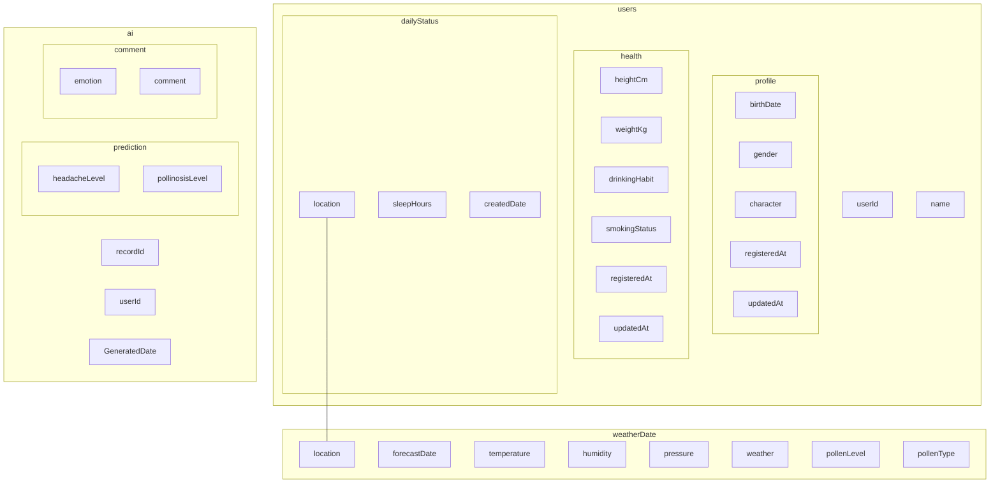

# データベース設計書

## 1. データベース概要

* データベース名: clearsky-db
* データベースの種類: NoSQL
* 使用DBMS: Cloud Firestore
* 設計方針: 
    * データの非正規化を許容する
    * クエリのパフォーマンスを考慮してインデックスを設計する

## 2. コレクション設計

| コレクション名 | 説明 |
|---|---|
| users | ユーザー情報を格納 |
| weatherData | APIから取得した気象情報等を格納 |
| ai | AI情報を格納|

## 3. ドキュメント定義

### `users`コレクション

| フィールド名 | データ型 | 説明 |
|---|---|---|
| userId | string | ユーザーID (Firebase Authentication UID) |
| name | string | ユーザー名 |

#### `profile`サブコレクション -> 固定値

| フィールド名 | データ型 | 説明 |
|---|---|---|
| birthDate | timestamp | 生年月日 |
| gender | number | 性別 (index)|
| character | number | キャラクター (index) |
| registeredAt | timestamp | 登録日時 |
| updatedAt | timestamp | 最終更新日時 |

#### `health`サブコレクション -> 固定値
| フィールド名 | データ型 | 説明 |
|---|---|---|
| heightCm | number | 身長（cm） |
| weightKg | number | 体重（kg） |
| drinkingHabit | string | 飲酒習慣（none|light|moderate|heavy） |
| smokingStatus | string | 喫煙習慣（none|light|moderate|heavy） |
| registeredAt | timestamp | 登録日時 |
| updatedAt | timestamp | 最終更新日時 |

#### `dailyStatus`サブコレクション -> 可変値
| フィールド名 | データ型 | 説明 |
|---|---|---|
| location | geopoint | 位置情報 | -> 気象情報に使用
| sleepHours | number | その日の睡眠時間 |
| createdDate | timestamp | 記録作成日時 |

---
### `weatherData`コレクション

| フィールド名 | データ型 | 説明 |
|---|---|---|
| location | geopoint | 位置情報 | => dailyStatus サブコレクションと連携
| forecastDate | timestamp | 記録日時 |
| weather | number | 天気コード |
| temperature_max | number | 最高気温 |
| temperature_min | number | 最低気温 |
| apparent_temperature_max | number | 体感最高気温 |
| apparent_temperature_min | number | 体感最低気温 |
| humidity | number | 湿度 |
| pressure | number | 気圧 |
| windSpeed | number | 風速 |
| pollenLevel | number | 花粉レベル |
| pollenType | string | 花粉の種類 |

---
### `ai`コレクション

| フィールド名 | データ型 | 説明 |
|---|---|---|
| recordId | string | 健康記録ID |
| userId | string | ユーザーID |
| GeneratedDate | timestamp | 生成日時 |

#### `predictionAI`サブコレクション　-> 予測AI

| フィールド名 | データ型 | 説明 |
|---|---|---|
| headacheLevel | number | 片頭痛の程度 (0-10) |

#### `assistantAI`サブコレクション -> アシスタントAI
| フィールド名 | データ型 | 説明 |
|---|---|---|
| emotion | number | 感情ステータス (index) |
| comment | String | ユーザーへのコメント |

#### `commentAI`サブコレクション -> 短文コメントAI
| フィールド名 | データ型 | 説明 |
|---|---|---|
| whether | string | 気象情報に対してのコメント | -> infoページに表示
| condition | String | ユーザーの体調コメント | -> playRoomページに表示

## 4. データ構造図

* `dailyStatus` サブコレクションと `weatherData` コレクションは、locationで関連付け
* `weatherData` コレクション の情報は `predictionAI` サブコレクションへ送信

## 5. その他

* セキュリティルール: 各コレクションに対して、Firebase Authentication を使用したアクセス制御を行う。

## ６. 更新履歴

* 2024/02/03: 初版作成
* 2025/02/05: 第2版作成  
  * `weatherData`コレクションを`open-meteo`APIに最適化  
  * `users` -> `profile`サブコレクションに`character`を追記  
  * `ai` -> `assistantAI`, `commentAI`サブコレクションを追記  