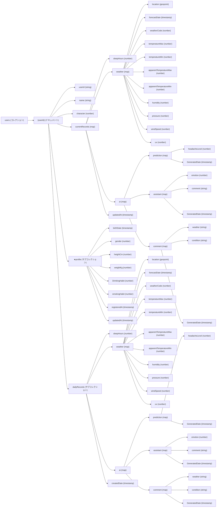

# データベース設計書

## 1. データベース概要

* データベース名: clearsky-db
* データベースの種類: NoSQL
* 使用DBMS: Cloud Firestore
* 設計方針: 
    * Firestore の非正規化の強み（読み取り回数の削減・データの即時取得）を活かす  
      → フロントエンドで必要な情報を 1 回の読み込みで取得できるように設計  
    * 頻繁に参照するデータをユーザードキュメント内に埋め込む (キャッシュ化)  
      ( → ユーザーのプロフィール、最新記録・AI結果、天気情報など )

## 2. コレクション設計

```
└── users (コレクション)
　   └── {userId} (ドキュメント)
　       ├── userId (string)
　       ├── name (string)
　       ├── character (number)
　       ├── currentRecords (map)
　       │   ├── sleepHours (number)
　       │   ├── weather (map)
　       │   │   ├── location (geopoint)
　       │   │   ├── forecastDate (timestamp)
　       │   │   ├── weatherCode (number)
　       │   │   ├── temperatureMax (number)
　       │   │   ├── temperatureMin (number)
　       │   │   ├── apparentTemperatureMax (number)
　       │   │   ├── apparentTemperatureMin (number)
　       │   │   ├── humidity (number)
　       │   │   ├── pressure (number)
　       │   │   ├── windSpeed (number)
　       │   │   └── uv (number)
　       │   ├── ai (map)
　       │   │   ├── prediction (map)
　       │   │   │   ├── headacheLevel (number)
　       │   │   │   └── GeneratedDate (timestamp)
　       │   │   ├── assistant (map)
　       │   │   │   ├── emotion (number)
　       │   │   │   ├── comment (string)
　       │   │   │   └── GeneratedDate (timestamp)
　       │   │   └── comment (map)
　       │   │       ├── weather (string)
　       │   │       ├── condition (string)
　       │   │       └── GeneratedDate (timestamp)
　       │   └── updatedAt (timestamp)
　       │
　       ├── ★profile (サブコレクション)
　       │   ├── birthDate (timestamp)
　       │   ├── gender (number)
　       │   ├── heightCm (number)
　       │   ├── weightKg (number)
　       │   ├── DrinkingHabit (number)
　       │   ├── smokingHabit (number)
　       │   ├── registeredAt (timestamp)
　       │   └── updatedAt  (timestamp)
　       │
　       └── dailyRecords (サブコレクション)
　           ├── sleepHours (number)
　           ├── weather (map)
　           │   ├── location (geopoint)
　           │   ├── forecastDate (timestamp)
　           │   ├── weatherCode (number)
　           │   ├── temperatureMax (number)
　           │   ├── temperatureMin (number)
　           │   ├── apparentTemperatureMax (number)
　           │   ├── apparentTemperatureMin (number)
　           │   ├── humidity (number)
　           │   ├── pressure (number)
　           │   ├── windSpeed (number)
　           │   └── uv (number)
　           ├── ai (map)
　           │　  ├── prediction (map)
　           │　  │   ├── headacheLevel (number)
　           │　  │   └── GeneratedDate (timestamp)
　           │　  ├── assistant (map)
　           │　  │   ├── emotion (number)
　           │　  │   ├── comment (string)
　           │　  │   └── GeneratedDate (timestamp)
　           │　  └── comment (map)
　           │　      ├── weather (string)
　           │　      ├── condition (string)
　           │　      └── GeneratedDate (timestamp)
　           └── createdDate (timestamp)
```

## 3. ドキュメント定義

### `users` コレクション

すべてのユーザー情報を 1 つのドキュメントにまとめ、頻繁に使用するデータは埋め込みオブジェクトとして保持。  
また詳細履歴や要保護情報はサブコレクションに切り出すが、フロント表示用の最新情報は非正規化して保持。

###  ユーザードキュメント

| フィールド名 | データ型 | 説明 |
|------------|---------|-----|
| userId     | string  | Firebase Authentication の UID |
| name       | string  | ユーザー名 |
| character  | number  | キャラクター (1: ハムスター, 2: 猫, 3: 犬, 4: ペンギン, 5: モモンガ, 6: コアラ, 7: うさぎ, 8: パンダ) |

---
### 埋め込み(map) `currentRecords` (最新日次記録)
ユーザーがフロントで最も頻繁に要求するデータを集約して保持。  
※ このフィールドは `dailyRecords` による詳細履歴と連動して更新される。

| フィールド名    | データ型    | 説明 |
|----------------|-------------|------|
| sleepHours     | number      | その日の睡眠時間  |
| weather        | object      | 天気情報のキャッシュ <br>・forecastDate: timestamp<br>・weatherCode: number<br>・temperatureMax, temperatureMin, etc. |
| ai             | object      | AI解析結果のキャッシュ <br>・commentAI: 短文コメント(体調, 天候) <br>・アシスタントAI: 感情, アドバイス<br>・予測AI：片頭痛レベル |
| updatedAt      | timestamp   | このキャッシュの更新日時 |

### 埋め込み(map) `weather` (天気情報)
天気情報の詳細。open-meteoAPIより取得する。

| フィールド名              | データ型   | 説明                              |
|--------------------------|-----------|---------------------------------|
| location                 | geopoint  | 測定地点の緯度・経度を表す     　　  |
| forecastDate             | timestamp | 天気予報が適用される日時            |
| weatherCode              | number    | 天気コード（0: 快晴 ~ 99: 雷雨）   |
| temperatureMax           | number    | 最高気温                         |
| temperatureMin           | number    | 最低気温                         |
| apparentTemperatureMax   | number    | 最高体感温度                      |
| apparentTemperatureMin   | number    | 最低体感温度                      |
| humidity                 | number    | 相対湿度（%）                     |
| pressure                 | number    | 気圧 (hPa)                       |
| windSpeed                | number    | 風速 (m/s)                       |
| uv                       | number    | 紫外線指数 (0: なし ~ 11:非常に強い) |


### 埋め込み(map) `ai` (AIデータ)
3種類のAIの出力結果。
AI情報はあくまでキャッシュとしての保存に留まるため、mapのネストで格納。

| フィールド名       | データ型    | 説明                                         |
|--------------------|------------|----------------------------------------------|
| prediction         | map        | ・headachelevel: number → 偏頭痛レベルの予測値<br>      ・GeneratedDate: timestamp → 予測結果の生成日時  |
| assistant          | map        | ・emotion: number → キャラクターの感情状態 (index)<br>  ・comment: string → ユーザーへのアドバイスやコメント <br> ・GeneratedDate: timestamp → 予測結果の生成日時 |
| comment            | map        |  ・weather: string → 天候に関するコメント <br> ・condition: string → ユーザーの体調に関するコメント <br> ・GeneratedDate: timestamp → 予測結果の生成日時  |

---
### サブコレクション: `profile` (★セキュリティ)
ユーザーの基本プロフィール情報。
個人情報につき、要保護情報として別途セキュリティ強化。  

| フィールド名  | データ型  | 説明 |
|---------------|-----------|------|
| birthDate     | timestamp | 生年月日 |
| gender        | number    | 性別 (0: 男性, 1: 女性, 2: その他) |
| heightCm      | number    | 身長 (cm) |
| weightKg      | number    | 体重 (kg) |
| drinkingHabit | number    | 飲酒習慣 (0: なし, 1: ほぼ毎日, 2: 週に数回, 3: 月に数回) |
| smokingHabit | number    | 喫煙習慣 (0: なし, 1: ほぼ毎日, 2: 週に数回, 3: 月に数回) |
| registeredAt  | timestamp | 登録日時 |
| updatedAt     | timestamp | 最終更新日時 |

### サブコレクション: `dailyRecords` (詳細履歴)
過去の日次記録として保持し、必要に応じた分析や詳細表示に利用。

| フィールド名 | データ型  | 説明 |
|--------------|-----------|------|
| sleepHours   | number    | 睡眠時間 |
| weather      | object    | 埋め込み天気情報（詳細履歴用） |
| ai           | object    | 当日のAI解析結果（prediction, assistant, comment の各結果） |
| createdDate  | timestamp | 記録作成日時 |

#### `commentAI`サブコレクション -> 短文コメントAI
| フィールド名 | データ型 | 説明 |
|---|---|---|
| weather | string | 気象情報に対してのコメント | -> infoページに表示
| condition | String | ユーザーの体調コメント | -> playRoomページに表示

## 4. データ構造図




## 5. その他

* セキュリティルール: 各コレクションに対して、Firebase Authentication を使用したアクセス制御を行う。


## ６. 更新履歴
## ６. 更新履歴

* 2024/02/03: 初版作成
* 2025/02/04: 第2版作成  
  * `weatherData`コレクションを`open-meteo`APIに最適化  
  * `weatherData`コレクションから花粉情報(`pollen`関連)を削除  
  * `users` -> `profile`サブコレクションに`character`を追記  
  * `ai` -> `assistantAI`, `commentAI`サブコレクションを追記  
* 2025/02/05: 第3版作成  
  * 様々な要件を整理し、NoSQLデータベースへ最適化
* 2025/02/06: 第4版作成
  * `weather`情報(map)に`uv`を追加
  * `~Records`情報(map)`location`の冗長化を一部解消